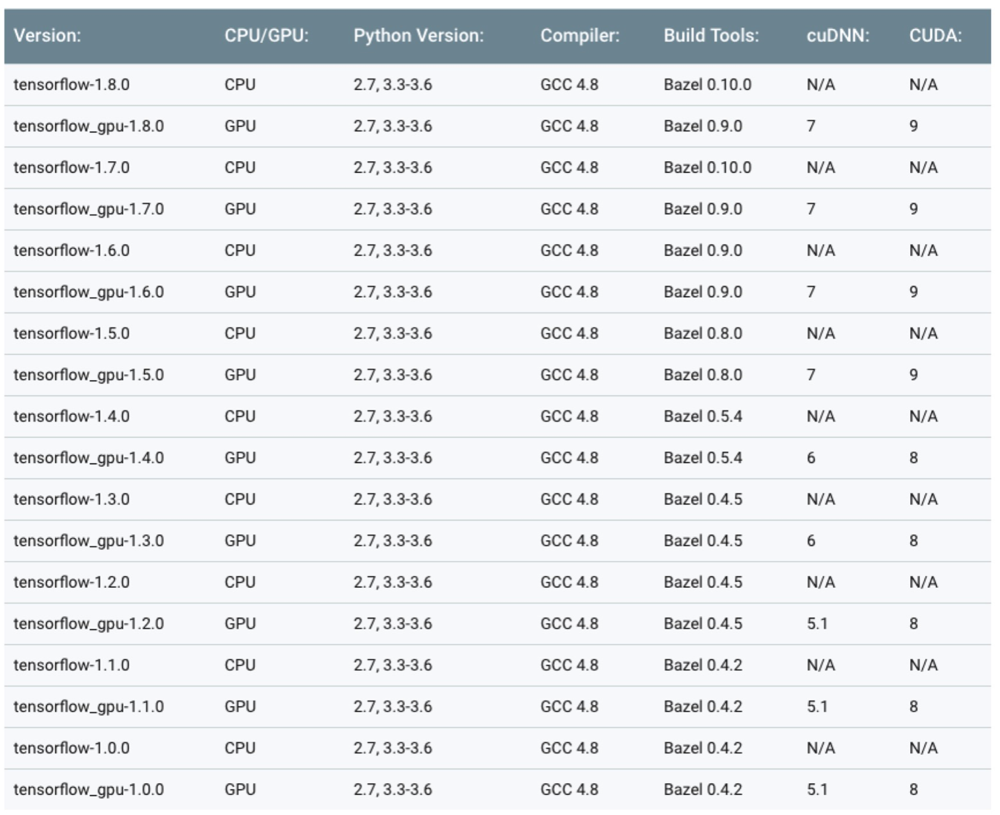

**From the table, find the required versions of cuda and cuDNN wrt installed tensorflow version**


**Remove current version cuda** 
>This will remove every associated files for a clean reinstallation
```
apt-get --purge remove cuda
apt-get autoremove
dpkg --list |grep "^rc" | cut -d " " -f 3 | xargs sudo dpkg --purge
```
**Remove cuda folders in /usr/local/**

**Installation**
>Download CUDA Toolkit 8.0  deb (local). 
```
cd /folder to which this toolkit has downloaded

dpkg -i cuda-repo-ubuntu1604-8-0-local_8.0.6-1_amd64-deb
apt-key add /var/cuda-repo-8-0-local/7fa2af80.pub
apt-get update
apt-get install cuda
```
**Add to PATH**
```export PATH=${PATH}:/usr/local/cuda-8.0/bin
export CUDA_HOME=${CUDA_HOME}:/usr/local/cuda:/usr/local/cuda-9.0
export LD_LIBRARY_PATH=${LD_LIBRARY_PATH}:/usr/local/cuda-9.0/lib64
```
**Download cuDNN as tar**
```
tar -xzvf cudnn-8.0-linux-x64-v5.1.tgz
sudo cp cuda/include/cudnn.h /usr/local/cuda/include
sudo cp cuda/lib64/libcudnn* /usr/local/cuda/lib64
sudo chmod a+r /usr/local/cuda/include/cudnn.h /usr/local/cuda/lib64/libcudnn*
```
**Get cuda toolkit from here**

https://developer.nvidia.com/cuda-toolkit-archive

**Get cudNN from**
https://developer.nvidia.com/rdp/cudnn-archive
